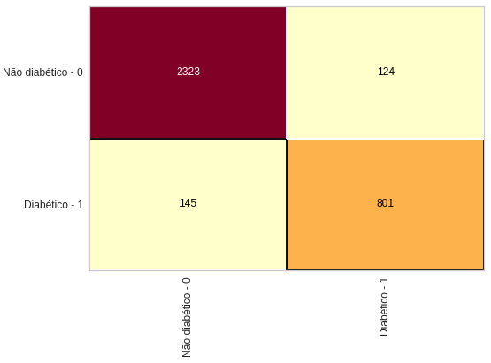

# DiabeteVision: Detecção de Diabetes com Random Forest
Bem-vindo ao projeto de **Detecção de Diabetes com Random Forest**! Este projeto tem como objetivo criar uma api para um modelo de machine learning que pode prever a presença ou ausência de diabetes em pacientes com base em um conjunto de características médicas e clínicas.
## Resumo do Projeto:
A detecção precoce e precisa de diabetes é de extrema importância para garantir o tratamento adequado e a qualidade de vida dos pacientes. Neste projeto, utilizamos o poderoso algoritmo de Random Forest para construir um modelo de classificação capaz de prever a ocorrência de diabetes com alta precisão.
## Desempenho do Modelo:

O nosso modelo de Random Forest foi treinado e avaliado usando um conjunto de dados de amostra. Os resultados mostram que o modelo atingiu uma impressionante precisão de 92%, o que significa que ele está acertando a detecção de diabetes em 92% dos casos.

Além disso, o modelo também alcançou uma boa revocação (recall) de 85% e uma pontuação F1 de 86%, o que indica que ele é eficaz tanto em identificar casos positivos de diabetes quanto em evitar falsos negativos.

A tabela de métricas de desempenho, que pode ser visualizada abaixo, ilustra a performance do nosso modelo em detalhes:

|                |precision|recall|f1-score|support|
|----------------|--------------|------------|-------------|-------------|
|Não diabetes - 0|0.94|0.95|0.95|2447|
|diabetes - 1    |0.87|0.85|0.86|946|
| accuracy |||0.92|3393|
|macro avg|0.90|0.90|0.90|3393|
|weighted avg|0.92|0.92|0.92|3393|

Esta tabela mostra como o modelo classificou os casos de diabetes (1) e não diabetes (0) e fornece uma visão abrangente do desempenho do modelo.

A matriz de confusão, que pode ser visualizada abaixo, oferece uma visão detalhada de como nosso modelo se comportou em relação aos casos de falsos positivos, ilustrando assim o desempenho detalhado do nosso modelo:

